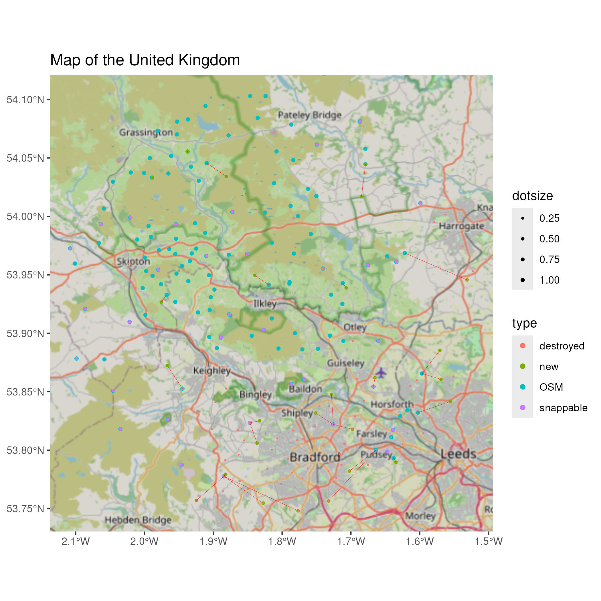
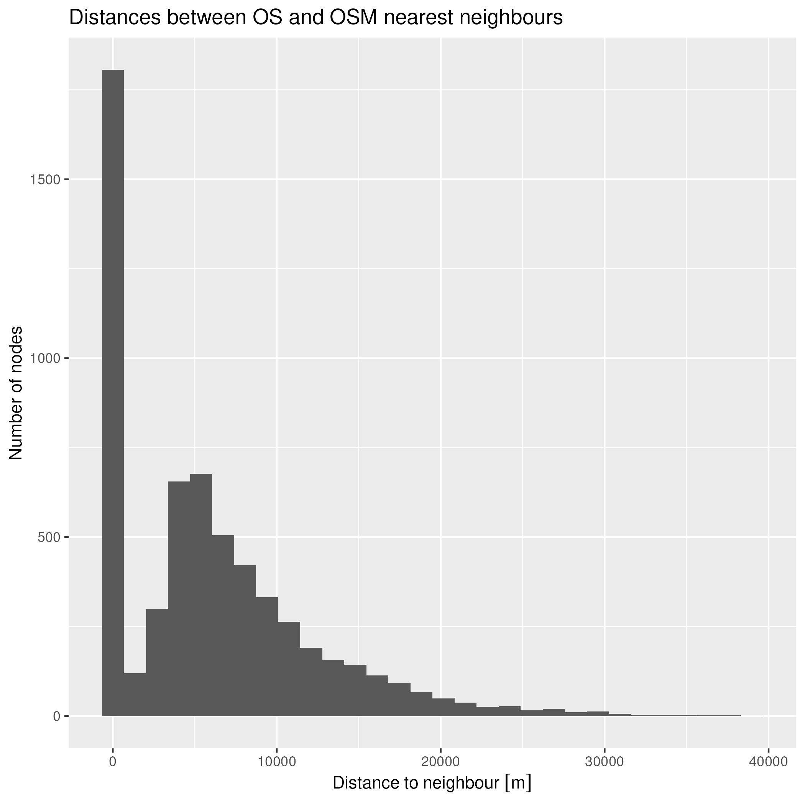
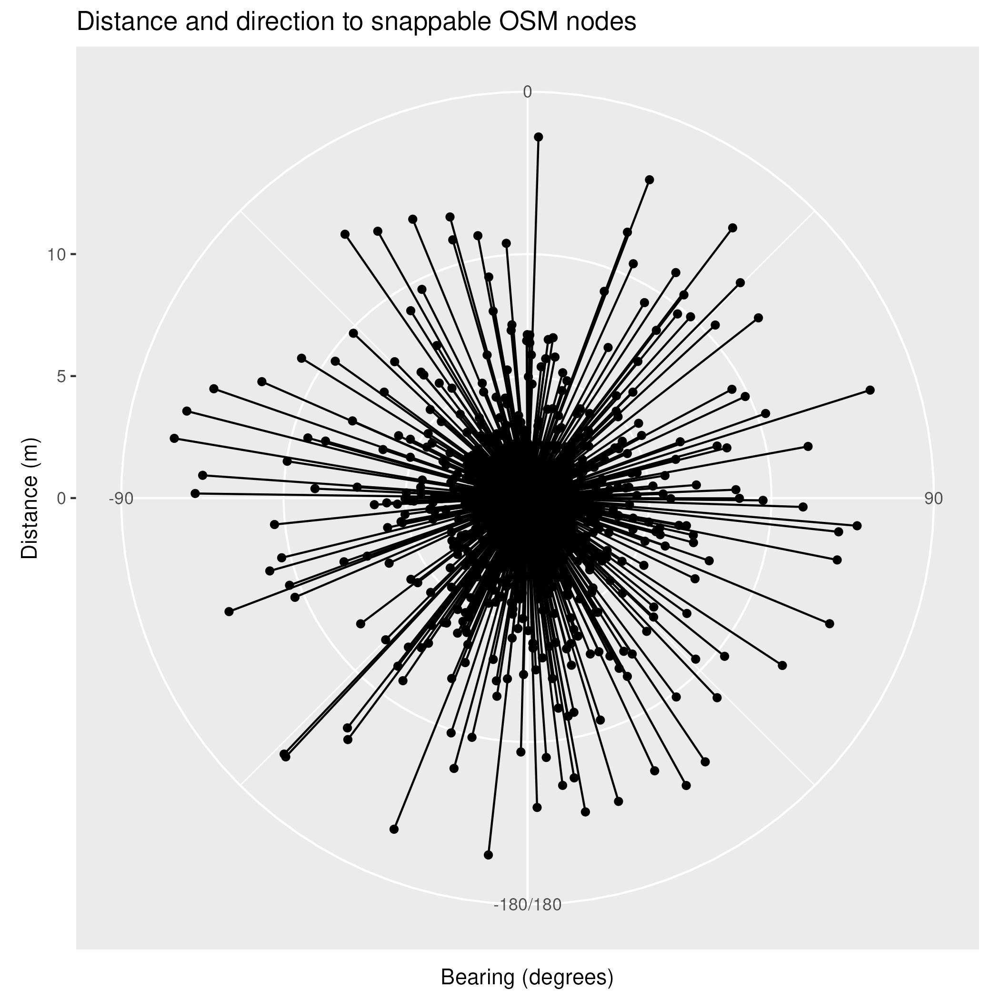

# UK Ordnance Survey triangulation pillars (trigpoints) for OpenStreetMap

The code in this repository can be used to process and assess the
[Ordnance Survey complete trig archive](https://www.ordnancesurvey.co.uk/documents/gps/CompleteTrigArchive.zip)
CSV with a view of importing some of that data into
[OpenStreetMap (**OSM**)](https://www.openstreetmap.org/).

Presently (as of 2026/06/02) the OSM data for UK trigpoints represents maybe only 1/3rd of the UK
pillar trigpoints - likely less as many OSM nodes do not represent current trigpoints afaict.

This is a work in progress. If the data is successfully imported into OSM then this repository will
be updated accordingly.

## Motivation

I've made a few very minor contributions to OSM in the past, mainly small objects near
where I live that were missing or missing places and roads I've noticed when on holiday (which is when
I use OSM maps the most).

In this instance, whilst thinking about what was not on the map near me, I realised there is a
[`trigpoint`](https://wiki.openstreetmap.org/wiki/Ordnance_Survey_triangulation_stations)
(we'll discuss what `trigpoint` might encompass in a bit...) about 1km from me that is
not in OSM. Well, that set me off looking for `trigpoint` data and led me down this rabbit hole...

## What is a `trigpoint`

Ah, well, it's not quite that simple a question. Technically it is a
[Triangulation Station](https://en.wikipedia.org/wiki/Triangulation_station), often abbreviated to
*trig* or  **trigpoint**. If you are a hiker you may be familiar with the concrete pillars you often
find when you reach the top of a summit.

But, no, it's still not quite that simple. There are a number of forms of survey marks created by the
Ordnance Survey (**OS**) dotted throughout the country. So, to be clear, initially at least we are
interested in the *classic* [Pillar](https://en.wikipedia.org/wiki/Triangulation_station) trigpoints.

## Existing data

This topic has been discussed before. There is a **very useful** 
[wiki page](https://wiki.openstreetmap.org/wiki/Ordnance_Survey_triangulation_stations)
from around 2016 - **do** give that a read (it took me more then one read to absorb all
the information!).

Then there was a thread on the
[Talk-GB OSM mailing list](https://lists.openstreetmap.org/pipermail/talk-gb/2019-July/023176.html).
discussing the topic and the related [TrigpointingUK](https://trigpointing.uk/) site that didn't
change the status quo.

The main sources of data then are from the OS and the OSM.

You can download the [Ordnance Survey complete trig archive](https://www.ordnancesurvey.co.uk/documents/gps/CompleteTrigArchive.zip).
In fact you will need to download that if you want to run the code here. It contains something in the
region of 31521 entries. Not all of these are PILLARs, and if we trim that dataset down to just PILLARs
then we get 6081 items.

We will also make use of the
[OS Benchmark data](https://www.ordnancesurvey.co.uk/documents/resources/CompleteBenchMarkArchive.zip)
as the trigpoint archive does **not** contain the
[Flush Bracket](https://wiki.trigpointing.uk/Flush_Bracket)
information, which ideally we will be adding to each OSM trigpoint entry. Sadly there is no easy to
use common index between the two OS datasets, but with a bit of 'fuzzing' we can extract a lot of
useful data. Oh, and note, the Benchmark archive contains **half a million** entries. Luckily
it is not too hard to extract just the trigpoints from that. We end up with 3957 trigpoint entries
from that database. Yes, that is only about 2/3rds of the trigpoints compared with the OS trigpoint
data. I have not yet investigated if the other 1/3rd of the data is in there but maybe does not
conform the the `TP` marking scheme.

Then you will also need the OSM data nodes that represent all current `trigpoints` in OSM.
I downloaded my data from [geofabrik.de](https://download.geofabrik.de/europe/united-kingdom.html)
and used [Osmosis](https://wiki.openstreetmap.org/wiki/Osmosis) to extract all entries with the tag
`man_made=survey_point`. I got 2804 nodes from that export.

After filtering out items where the `survery_point` and `survey_point_structure` tags indicate they
are not pillars, we end up with 2558 OSM datapoints.

In summary for the potential pillar datapoints we have then:

| Source | Number |
| ------ | ------ |
| OS Trigpoint database | 6081 |
| OS Benchmark database | 3957 |
| OSM database |  2558 |

## Processing the data

Here is a rough outline of how we process the data:

  - Load the databases
    - that is, read in the data from the OS trigpoint, OS benchmark and OSM files
  - Trim the data
    - For the OS trigpoint data
	  - Remove any DESTROYED items
	  - Remove any item not marked as a PILLAR
    - For the OS Benchmark data
	  - Only keep entries that are marked with the `TP` indicator
    - For the OSM data
	  - Filter out any item that specifically states in a `survey_point` or `survey_point_structure`
	    tag that it is *not* a pillar - for instance, `bolt`, `beacon` etc.
  - Correlate the data
    - Calculate and record which OSM node is nearest to each OS trigpoint and how far away it is
    - Calculate and record which OS benchmark node is nearest to each OS trigpoint and how far away it is
	- Extract the Flush Bracket data from OS Benchmark data
  - Sanity check the data
    - Ensure we only use 'neighbours' that are not too far away (<=15m is a good start)
	- Do a name check between OS trigpoints and their OS benchmark neighbours
  - And then try to make sense of it all...
    - If we have an OS Benchmark pillar within 15m of an OS pillar, and we can match up their
	  respective names, then assign the Benchmark Flush Bracket number to the OS pillar.
    - If we have an OSM node within 15m of an OS trigpoint, mark the pair as potentially 'snappable,
	  that is - can we update the OSM node with new co-ordinates from the OS pillar.
    - If an OS pillar does not have an OSM node within 15m of it, mark that OS pillar data as a
	  potentially new OSM node.
    
There is more we can do here, but have not yet implemented. For instance:

  - Check if the OSM node has a `ref` that looks like a Flush Bracket number, and correlate
  - Similarly if we think the OSM node has a 'name'

Sadly the OSM `man_made=survey_point` data is quite inconsistent in the use of tags and their contents,
which makes correlating them and doing 'clean updates' potentially quite difficult.

>   A note on importing the OSM data. Underneath the `sf` library we use, it uses the
>  [GDAL](https://gdal.org/en/stable/) library. By default, when importing `osm` files, that library
>  drops some tags and merges a whole bunch of others into a single `other_tags` column. This by
>  default for us is not that useful, as it makes accessing some data we'd like quite hard. Thus,
>  we carry our own `my_osmconf.ini` file that we pass in to `sf/GDAL` to put all the data we'd like
>  in their own columns, and thus easier for us to process.
>   Originally I did write the code to expand `other_tags` out, but it was slow and painful, and having
>  our own config file is a much better way.

## Generating output

Ultimately, the goal is to import all the pillar trigpoints into OSM. With somewhere in the region
of 6000 points, that would be quite an undertaking to do by hand. Ideally we'll be able to automate
some of the process.

To that end, the code currently generates two
[OsmChange (OSC)](https://wiki.openstreetmap.org/wiki/OsmChange) files. One contains all the
proposed edits to existing OSM nodes, and the other all the proposed new nodes.

## What do the results 'look like'

To aid debug and analysis, you can enable some code in the scripts that will reduce the dataset
to a defined area and then plot those results. Zooming in makes the plots much more readable, as having
~10,000 dots splatted across a UK map does not make a meaningful image.

Here is an example image zoomed around Ilkley in West Yorkshire, and below it an explanation of
what the point colours are indicating. It helps to understand how the alignments, matching and
subsequent filtering are working out.



Here is a quick overview of the sort of data that is showing:

  - Any purple dots (snappable OS) with a blue fringe (OSM point behind it) shows there is potential
    to update an OSM datapoint to match the OS datapoint
  - Any green dot is showing an OS point that does not have any OSM point near enough to be considered
	- the red line pointing to a blue dot is showing where the nearest OSM point is
  - Any blue dots are showing OSM data points that are not the nearest to any OS point (and thus
    are potential candidates for review? There do seem to be *many* historic trigpoints recorded
	in the OSM data that potentially no longer physically exist)
  - Orange dots are deleted points. These become interesting when they overlay other points, showing
    that, for OS points, the point may have been udpated/replaced, and for OSM points, that the OSM
	point might be referencing a destroyed OS point (and also thus may be a candidate for review).

## More technical details

Here we will dive into a few of the inner details and decisions around the code.

### Deciding what is 'snappable'

We need some method to try and decide if there is any OSM data point that may represent the same
`PILLAR` as an OS point. If we think they are trying to represent the same item, and they differ by
say their precise co-ordinates, then we would want to consider updating the exsiting OSM data points
co-ordinates to match that of the definitive OS data.

If we plot the distances from the OS points to their nearest OSM points we get (the Y scale is in
metres):



OK, that shows that many of them (~1750?) are very short distances, which is good.
And then we can see that there are many others that are 5000m or more away. That feels like there is
a fairly good delineation between points to consider as close and those which are almost definitely
unrelated. Now let's zoom in on that a bit:


Ah, that's better. That shows us that many points are within maybe 7.5m, and things have definitely
tailed off by say 15m. Thus, we are experimenting with 15m as the 'snappable' cutoff distance.

### OS co-ordinates

Oh, and then we have the co-ordinates systems used in the OS data. The trigpoint data is not so bad,
that comes as OSBG36 format data, which the R `sf` package can translate for us.

The OS benchmark data however comes as UK National Grid data with a two letter grid code and two
four digit numbers. I could not find a way for `sf` to translate that, but did find that the OS have
released a library called [osbng](https://github.com/OrdnanceSurvey/osbng-r) that we can use to do
the translation for us - phew. Note, that 8 digit British National Grid references only give us
[a resolution of 10m](https://digimap.edina.ac.uk/help/our-maps-and-data/bng/) afaict, so having
small positional discrepencies between OS and OSB data I think should be expected.

Ultimately we convert everything to WGS84 before crunching the data.

One more thing I did here was to have a look at the data to try and ensure our co-ordinates translation
didn't contain any obvious errors. To do that I looked at the bearing direction for each 'neighbour'
pair between the OS and OSM data. My theory was that if our translation was off by a uniform direction
then that would show as a bias in 'nearest neighbour' - maybe. Anyhow, here is how the data looks:



That looks pretty uniform to me.

### Extracting the Flush Bracket data

The flush bracket data is buried in the `DESCRIPTION` field of the Benchmark data, along with other
keywords and the name of the trigpoint. Here is an example:

>    `FL BR S1695 W FACE DANEBURY HILL TP'

OK, as described in the
[Benchmark abbreviations document](https://www.ordnancesurvey.co.uk/documents/resources/OSBM-list-abbreviations.pdf)
we can see `FL BR` for **Fl**ush **Br**acket, followed by a bracket number. We can parse for that. Ah,
but, if it were only so easy. The data is inconsistent. You will find a comment in the code detailing
the many variations I came across. There were at least 20 variations, and they are now captured using
a set of nine different regular expressions.

### Matching OS trigpoint names to benchmark names

We need some way to try and correlate or confirm (apart from just checking for identical co-ordinates)
between the OS trigpoints and the OS benchmark data. Apart from the co-ordinates the only common
entry is the 'name' of the trigpoint. Sadly this is not the uniform `STATION NAME` or `New Name` found
in the trigpoint data, but is the rather more informal freeform `Trig Name` - i.e., the 'name of the
place'.

The names are again buried in the OS benchmark `DESCRIPTION` field, but we can do a first pass search
by checking for a substring match with the OS name. That gave us a pretty good set of results, but
there were still hundreds not matching. Now, some of those I expect to not match as maybe they are
not the same trigpoint or something had been destroyed but still referenced etc., but, if we have
a look at some of the items that do not match we can see the data is inconsistent:

```
	OS [Under-The-Hill] 3.91099111685471m from OSB [FL BR S5376 UNDER THE HILL TP]
	OS [Unity Farm] 5.58125716774579m from OSB [FL BR 3249 UNITY FM TP]
	OS [Upper Hartsay] 5.0274007217178m from OSB [FL BR S4534 UPPER HARTSHAY TP SW FACE]
	OS [Upper Norton Farm] 3.70760782183571m from OSB [FL BR S3821 UPPER NORTON TP E FACE  ]
	OS [Vatches Farm] 9.24280452986345m from OSB [FL BR S4513 VATCHES FM TP]
	OS [Walk Farm] 3.40441532822191m from OSB [FL BR S4919 WALK FM TP NW FACE  ]
```

So, we have a whole bunch of mixture of abbreviations (Farm vs FM), punctuation (Under-The vs
UNDER THE) and different spellings (Hartsay vs HARTSHAY). This is not going to be resolved with
some simple expressions.

I've added some 'fuzzy matching' to the name matching code between OS and OSB/OSM names. We do some
rudimentary filtering on the name strings and then use a
[`stringdist`](https://cran.r-project.org/web/packages/stringdist/index.html) with the
[Jaro Winkler](https://en.wikipedia.org/wiki/Jaro%E2%80%93Winkler_distance) algorithm to do a fuzzy
compare. That has gained us an extra 377 OSB matches and 18 OSM matches.

### Running the code

The code is predominantly written in [`R`](https://www.r-project.org/about.html) as that is the
data processing language I'm most familiar with - but, I am by no means an expert.

The actual code is run inside a [Docker container](https://en.wikipedia.org/wiki/Docker_(software))
because not only did I want to have to install and maintain an R installation on my main machine, but
it gives us a bit of insulation against future library version changes, hopefully.

First, you will need to obtain and install some data files

#### Getting the data

Before processing we need to obtain three sets of data, and one needs a little preperation:

##### OS Trigpoint data

The OS Trigpoint data CSV file can be obtained
[here](https://www.ordnancesurvey.co.uk/documents/gps/CompleteTrigArchive.zip)

Unzip the archive and place the `CompleteTrigArchive.csv` file in the `data` folder.

##### OS Benchmark data
The OS Benchmark data CSV file can be obtained
[here](https://www.ordnancesurvey.co.uk/documents/resources/CompleteBenchMarkArchive.zip)

Unzip the archive and place the `CompleteBenchMarkArchive.csv` file in the `data` folder.

##### OSM `man_made=survey_point` data

Obtain or generate an OSM `.osm` XML file with all the nodes that match the `man_made=survey_point`
tag. I did this by obtaining the complete `pbf` for the UK from
[geofabrik.de](https://download.geofabrik.de/europe/great-britain.html) and then used
[osmosis](https://wiki.openstreetmap.org/wiki/Osmosis) to extract the tags:

```
$ osmosis --read-pbf ./great-britain-260527.osm.pbf --node-key-value keyValueList="man_made.survey_point" --write-xml gb_trigpoints.osm 
```

Then copy that `gb_trigpoints.osm` file to the `data` folder.

##### Finally, run the code

Presuming you have a working Docker installed (an exercise for the user), you need to build the
docker image:

```$ ./dockerbuild.sh```

and then you can run the script

```$ ./dockerrun.sh```

This should print out a bunch of information and leave you with some files in the `data` subfolder.

If you want to run the R code by hand maybe to do some debug or repeated runs without having to
instantiate a new container each time, you can use the `dockershell.sh` script, which will place
you inside a Docker container at a prompt. You can then do something like:

```
$ ./dockershell.sh
# cd data
# R
> source('process.R')
 # then maybe examine the internal data
> osm_sf
 # or do an external edit on process.R and run it again
> source('process.R')
 # etc. etc.
```

## Next Steps

The next thing to do is approach the
[UK OSM community](https://community.openstreetmap.org/c/communities/uk/86) to discuss viability
and path forward. Then, given the whole idea is not shot down, and if we think we might be able
to do an automatic import, we should study the
[OSM import guidelines](https://wiki.openstreetmap.org/wiki/Import/Guidelines)
and write an [import plan](https://wiki.openstreetmap.org/wiki/Import/Plan_Outline). That will also
force us to push the code forwards, as there are at least a couple of items left to enhance:

  - We can use the name and flush bracket matching data to make better decisions about what is
    an updatable existing OSM node and what is a new node.
  - We have not discussed or formalised what data will go into what named tag - and how we will handle
    this between updates or new nodes.

## TODO

A few thoughts on things left to do, apart from community discussions and documentation on the
OSM wiki etc.:

  - At some point add descriptions of the generated data files here - right now you will have to stare
    hard to understand what you are getting out of the scripts.
  - See if the missing 1/3rd of the trigpoint data in the Benchmark CSV is hiding in there somewhere

