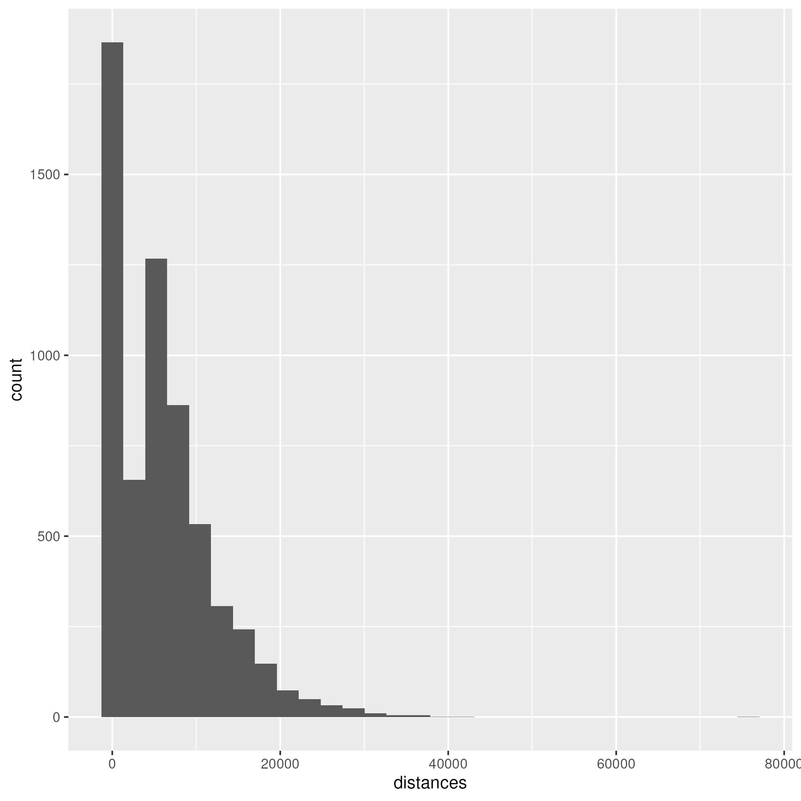
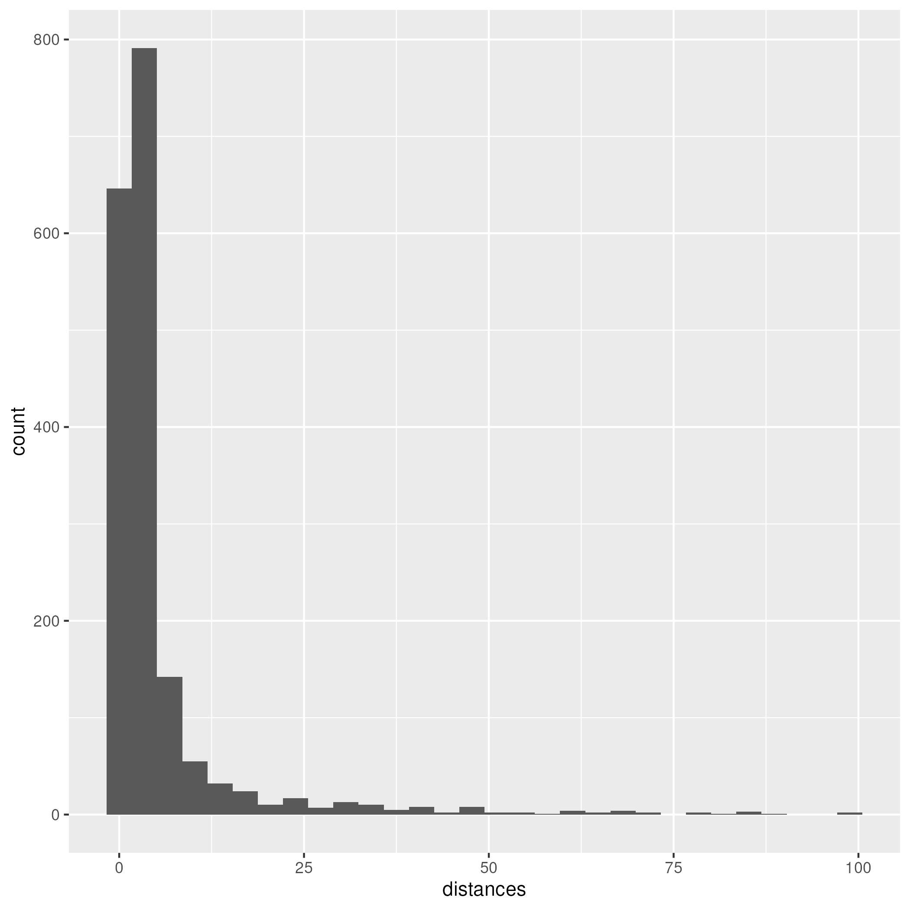

# Ordnance Survey triangulation pillars (trigpoints) for OpenStreetMap

The code in this repository can be used to process and assess the
[Ordnance Survey complete trig archive](https://www.ordnancesurvey.co.uk/documents/gps/CompleteTrigArchive.zip)
CSV with a view of importing some of that data into
[OpenStreetMap](https://www.openstreetmap.org/#map=19/53.967917/-1.850778).

## Motivation

I've made a few very minor contributions to OpenStreeMap (OSM) in the past, mainly small objects near
where I live that were missing or missing places and roads I've noticed when on holiday (which is when
I use OSM maps the most).

In this instance, whilst thinking about what was not on the map near me, I realised there is a
`trigpoint` (we'll discuss what `trigpoint` might encompass in a bit...) about 1km from me that is
not in OSM. Well, that set me off looking for `trigpoint` data and led me down this rabbit hole...

## What is a `trigpoint`

Ah, well, it's not quite that simple a question. Technically it is a
[Triangulation Station](https://en.wikipedia.org/wiki/Triangulation_station), also called a
*triangulation station*, hence *trig* - or **trigpoint**.

But, no, it's not quite that simple. There are a number of forms of survey marks created by the
Ordnance Survey (OS) dotted throughout the country. So, to be clear, initially at least we are interested
in the *classic* [Pillar](https://en.wikipedia.org/wiki/Triangulation_station) trigpoints. We will
discuss other items a bit more in the analysis section.

## References

You can download the [Ordnance Survey complete trig archive](https://www.ordnancesurvey.co.uk/documents/gps/CompleteTrigArchive.zip).
In fact you will need to download that if you want to run the code here.

Then you will also need the OSM data nodes that represent all current `trigpoints` in OSM. See the
Analysis secton for more details of where I got mine from and how I pre-processed/filtered it.

Back in 2016/2019 there was already some really good analysis done on this topic, which can be found
in the OSM [wiki page](https://en.wikipedia.org/wiki/Triangulation_station). Do give that a read.

A thread can also be found on the [Talk-GB OSM mailing list](https://lists.openstreetmap.org/pipermail/talk-gb/2019-July/023176.html).

## The plan

As I learnt more about the data the plan slowly changed. The current plan can be summarised as two
distint actions:

  - Update any existing OSM trigpoints that can be aligned with OS data so they match (using the OS
    data as the definitive source)
  - Add new OSM `trigpoint` nodes for any OS Pillar trigpoints that do not appear in the OSM data.

This of course leaves us with some data processing and a bit of fuzzing to do - how do we match OS
data points to potential OSM data points. More of that in the Analysis section then...

## Coding

I chose to write the analysis code in [R](https://www.r-project.org/), because I have some familiarity
with it already. I also configure and run the R code within a Docker container. This has two benefits:

  - You don't have to configure your host machine with the exact `R` setup required
  - We have a fixed `R` environment to run in, so we should not run into any version issues etc.

## Analysis

First, we should get the data and do some initial process to see what we have. The OS data comes as a
DOS formatted CSV file. I run linux, so I converted that over to Unix format to start with. Within
`R` I read this CSV file and use the [`sf` package](https://r-spatial.github.io/sf/) to convert the
data from its supplied OSGB National Grid (`Easting` and `Northing`) references into `WGS84`, which
is the format OSM uses. This then makes all future calculations and comparisons easier. The `sf`
package is specifically made for storing geographic features.

If we take a quick look at the OS data, there are some notable stats and elements:

  - There are 31521 entries !
  - The `TYPE.OF.MARK` field tells us what item is being described. For us, we want `PILLAR`.
    - 7111 of those entries are for `PILLAR`s
  - The `DESTROYED.MARK.INDICATOR` tells us if that entry has physically been destroyed (aka, no longer
    exists!)
	- 1030 of the `PILLAR` entries have been destroyed
	- Leaving us with 6079 valid `PILLAR` entries

Now, let's have a peek at the OSM data. First we should get the data. I got my data by downloading
a complete UK OSM `osm.pbf` file from
[geofabrik.de](https://download.geofabrik.de/europe/united-kingdom.html). Note, it is a moderately
hefty file at around 2GB.

Now, that contains *all* OSM data for the UK, and we only need the trigpoint data. As noted on the
existing OSM wiki page about UK trigpoints, that will be `node` entries with a tag of
`man_made=survey_point`. In order to extract those I used the OSM `osmosis` tool:

```bash
> osmosis --read-pbf ./united-kingdom-260519.osm.pbf --node-key-value keyValueList="man_made.survey_point" --write-xml trigpoints.osm
```
I then read that into `R` using `read_sf()`, which underneath uses the
[GDAL](https://gdal.org/en/stable/) libray to do the import. This has some limitations which will be
discussed later in the document.

If we take a peek at that OSM data then:

  - It has 5857 entries with that `survey_point` tag.

The optimist might think that having 6079 OS entries and 5857 OSM entries could indicate that we
are potentially 96% OSM complete already! Sadly further analysis will show that is likely not the
case...

### Crunch the data some more

OK, the `R` code does a bunch of crunching. Things it churns out are:

 - What is the nearest OSM point for each OS point, giving us an indication of
   - correlation of datasets
   - and pointing to which OSM point we might need to coerce to match the OS data
 - Plots on a map showing all the:
   - OS destroyed points
   - OSM points
   - OS points that have potential 'snappable' OSM points near them
   - OS points that do not have any OSM candidates near them to compare against

This allows us a quick visual analysis of how things are working out. If you enable a debug mode in
the `R` code then it will subset the data down to a small part of the UK to make viewing easier, as
trying to view ~12000 points on a map of the UK is rather dense and messy.

Here is a plot of an area around Ilkley:


Here is a quick overview of the sort of data that is showing:

  - Any purple dots (snappable OS) with a blue fringe (OSM point behind it) shows there is potential
    to update an OSM datapoint to match the OS datapoint
  - Any green dot is showing an OS point that does not have any OSM point near enough to be considered
    - (we will discuss how that is decided in a moment)
	- the red line pointing to a blue dot is showing where the nearest OSM point is
  - Any glue dots are showing OSM data points that are not the nearest to any OS point (and thus
    are potential candidates for review?)
  - Orange dots are deleted points. These become interesting when they overlay other points, showing
    that, for OS points, the point may have been udpated/replaced, and for OSM points, that the OSM
	point might be referencing a destroyed OS point (and also thus may be a candidate for review).

### Deciding what is 'snappable'

We need some method to try and decide if there is any OSM data point that may represent the same
`PILLAR` as an OS point. If we think they are trying to represent the same item, and they differ by
say their precise co-ordinates, then we would want to consider updating the exsiting OSM data points
co-ordinates to match that of the definitive OS data.

If we plot the distances from the OS points to their nearest OSM points we get:



OK, that shows that many of them are very short, which is good. Now let's zoom in on that a bit:



Ah, that's better. That shows us that many points are within 10m

## Running the code

## How it works

## Current status

